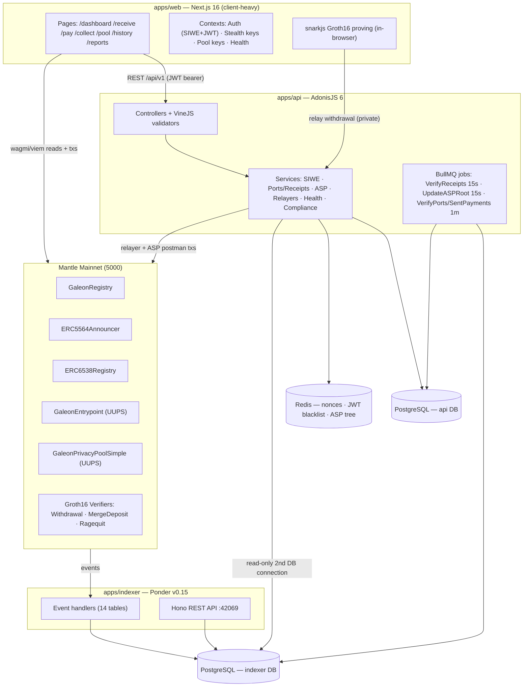
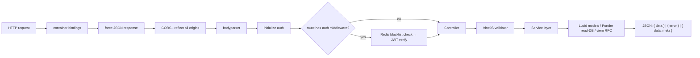
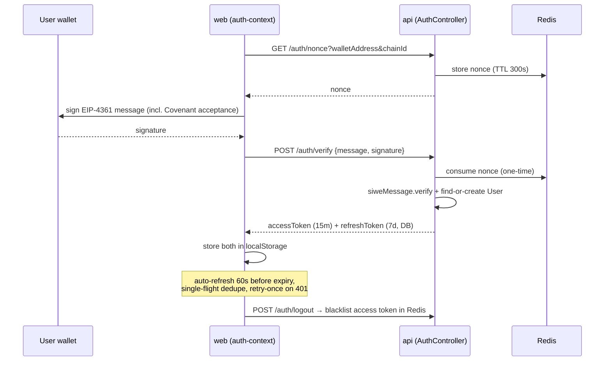
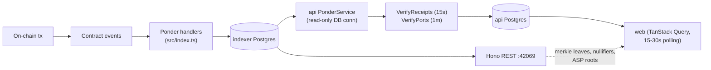
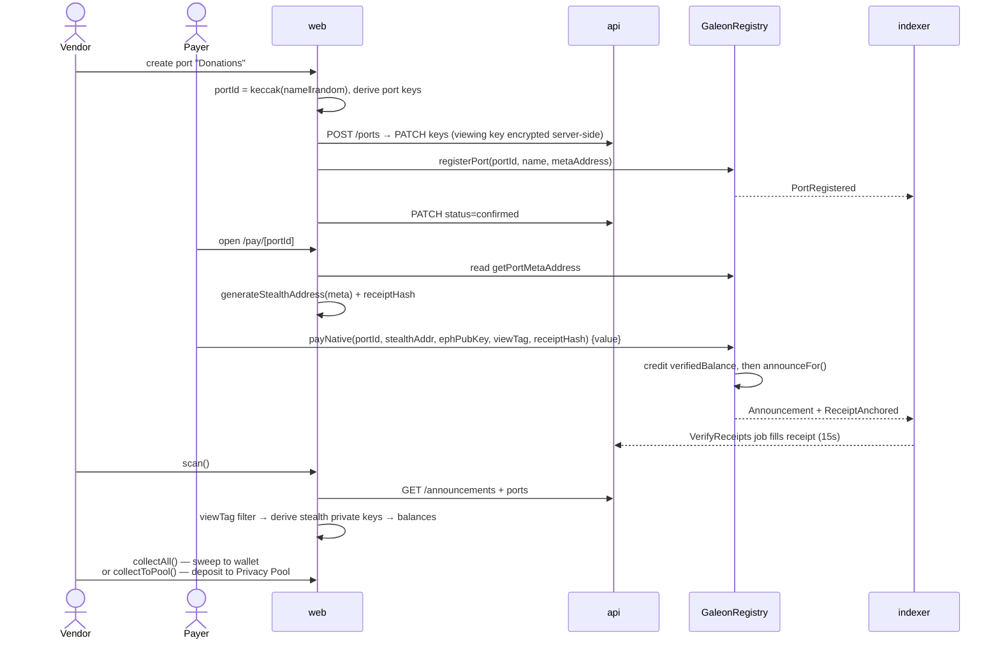
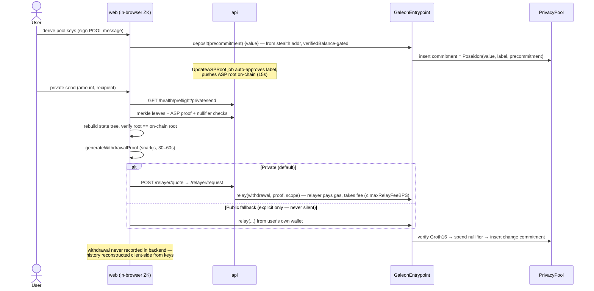
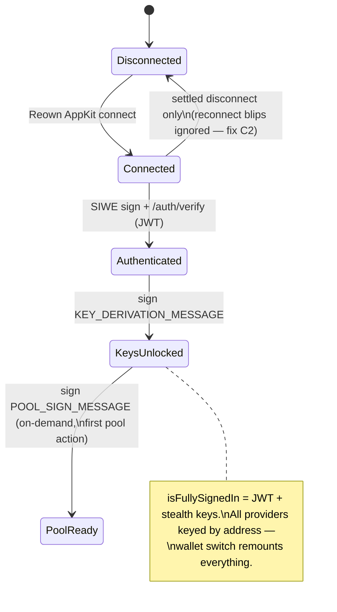

# Galeon — Framework & Architecture Review

> Generated 2026-07-21 from a full read of the codebase (apps/web, apps/api, apps/indexer, packages/\*).
> Galeon is a private-payments platform on Mantle: **receive** at EIP-5564 stealth addresses, **send** through a ZK Privacy Pool (adapted from 0xbow), and **export** payment and tax-oriented Shipwreck reports.

---

## 1. High-Level Architecture

Three trust/execution zones:

1. **Client-side crypto** — stealth & pool keys are derived from wallet signatures in the browser and never leave it (except the **viewing key**, which is stored server-side encrypted with `APP_KEY`). ZK proofs are generated in-browser with snarkjs.
2. **Backend** — auth, port/receipt bookkeeping, the ASP (Association Set Provider), and two relayer wallets that submit txs on users' behalf.
3. **Chain + indexer** — contracts emit events; Ponder indexes them into its own Postgres, which both the API (direct DB connection) and clients (Hono REST) read.

---

## 2. Stack

| Layer        | Technology                                                                               | Notes                                                                 |
| ------------ | ---------------------------------------------------------------------------------------- | --------------------------------------------------------------------- |
| Monorepo     | Turborepo + pnpm workspaces, Node ≥22                                                    | husky + commitlint (conventional commits), lint-staged                |
| Frontend     | Next.js ^16.1 (App Router), React ^19, TypeScript ^5.9                                   | Turbopack dev / webpack build; crypto libs aliased out of SSR         |
| Web3 (front) | wagmi ^3.1, viem ^2.43, Reown AppKit ^1.8, TanStack Query ^5.90                          | Cookie-based wagmi SSR state; providers keyed by wallet address       |
| Styling      | Tailwind v4, shadcn/ui + Radix, motion ^12, lucide-react                                 | Dark deep-sea theme                                                   |
| Backend      | AdonisJS ^6.18 (ESM), Lucid ORM → PostgreSQL, VineJS validation                          | `@adonisjs/transmit` is installed but **not wired** — no SSE (see §8) |
| Auth         | SIWE (`siwe` ^2.3) → JWT (`@maximemrf/adonisjs-jwt`), refresh tokens in DB               | Access 15 min / refresh 7 d; Redis token blacklist on logout          |
| Jobs         | adonisjs-jobs (BullMQ over Redis) + adonisjs-scheduler                                   | Verification + ASP loops                                              |
| Indexer      | Ponder v0.15.17 + Hono API, own PostgreSQL                                               | Mantle mainnet only, startBlock 89365202                              |
| Contracts    | Solidity 0.8.20/0.8.24, Hardhat + OpenZeppelin (UUPS for pool), typechain                | Deployed on Mantle 5000; Sepolia 5003 placeholders                    |
| Crypto       | @noble/curves 2 (secp256k1), @noble/hashes 2 (HKDF), poseidon (maci-crypto), snarkjs 0.7 | Groth16 / BN254; LeanIMT merkle trees (@zk-kit/lean-imt)              |

### Workspace map

| Package             | Purpose                                                                      | Key exports                                                                          |
| ------------------- | ---------------------------------------------------------------------------- | ------------------------------------------------------------------------------------ |
| `apps/web`          | Next.js frontend — all user flows, in-browser proving                        | —                                                                                    |
| `apps/api`          | AdonisJS backend — auth, ports/receipts, ASP, relayers, compliance PDFs      | REST `/api/v1/*`                                                                     |
| `apps/indexer`      | Ponder indexer — 5 contracts → 14 tables → Hono REST                         | `/announcements`, `/pools/...`, `/nullifiers/:hex`, `/asp-roots/latest` …            |
| `@galeon/stealth`   | EIP-5564/6538 crypto: HKDF key derivation, stealth addresses, scanning       | `deriveStealthKeys`, `derivePortKeys`, `generateStealthAddress`, `scanAnnouncements` |
| `@galeon/pool`      | Privacy Pool SDK: commitments, recovery, merkle, Groth16 proving             | `createDepositSecrets`, `recoverPoolDeposits`, `generateWithdrawalProof`             |
| `@galeon/contracts` | Solidity: Registry, Announcer, ERC6538, Entrypoint, Pools, Verifiers         | typechain types, deploy scripts                                                      |
| `@galeon/config`    | Chains (5000/5003), contract addresses, viem ABIs                            | `CONTRACTS`, `getPoolContracts`, `entrypointAbi`, `SCHEME_ID = 1n`                   |
| `@galeon/types`     | Pure shared TS types (entities + API DTOs)                                   | `Port`, `Receipt`, `PaginatedResponse<T>` …                                          |
| `packages/0xbow`    | Read-only git submodule: upstream 0xbow privacy-pools-core (circuits origin) | —                                                                                    |

---

## 3. Request Lifecycle

### 3.1 API request lifecycle (AdonisJS)

- Middleware stack lives in `apps/api/start/kernel.ts`; `auth_middleware` checks the Redis token blacklist **before** verifying the JWT.
- Rate-limit middleware exists (`rate_limit_middleware.ts`, Redis sliding window) but is **commented out** in the kernel — not active.
- Controllers are thin; all logic sits in `app/services/*` (see §5).

### 3.2 SIWE authentication sequence

### 3.3 Chain-data lifecycle (event → UI)

There is **no push channel** — freshness comes from polling (ports 15 s, health 30 s), background verification jobs, and optimistic cache writes on the frontend to hide indexer lag.

---

## 4. Smart Contracts (Mantle Mainnet 5000)

| Contract                  | Address       | Purpose                                                                       | Upgradeability      |
| ------------------------- | ------------- | ----------------------------------------------------------------------------- | ------------------- |
| `GaleonRegistry`          | `0x9bcD…1e9D` | Ports, `payNative`/`payToken`, receipt anchoring, `verifiedBalance`, freezing | No (immutable refs) |
| `ERC5564Announcer`        | `0x8C04…1153` | Stealth announcements; `announceFor` gated to trusted relayers (Registry)     | No                  |
| `ERC6538Registry`         | `0xE658…Dc22` | Stealth meta-address registry (standard)                                      | No                  |
| `GaleonEntrypoint`        | `0x8633…fb21` | Pool registry, ASP roots, deposit routing, `relay`, `mergeDeposit`            | UUPS                |
| `GaleonPrivacyPoolSimple` | `0xE271…59C0` | Native MNT mixing pool (state = LeanIMT + Poseidon)                           | UUPS                |
| Verifiers (3)             | see README    | Groth16: Withdrawal / MergeDeposit / Ragequit                                 | Swappable via owner |

Key mechanics:

- **Payment metadata layout** (built in `GaleonRegistry.payNative:187`): `viewTag(1) + receiptHash(32) + portId(32)` (+ `token(20) + amount(32)` for ERC-20) — parsed identically by `@galeon/stealth` scan and the indexer.
- **verifiedBalance gating**: `payNative` credits the stealth address; `PrivacyPool.deposit` requires `canDeposit()` and consumes it — only funds that arrived via a Port can enter the pool.
- **Commitment scheme**: `commitment = Poseidon4(value, label, precommitment)`, `precommitment = Poseidon2(nullifier, secret)`; withdrawal spends a nullifier hash and inserts a change commitment; `mergeDeposit` (Galeon's addition to 0xbow) folds a new deposit into an existing commitment for O(1) withdrawals.
- **ASP**: Entrypoint stores association-set roots pushed by the backend's postman wallet; proofs must reference an ASP root (hackathon ASP auto-approves everything).

---

## 5. Important Functions & Services (cheat sheet)

### Crypto core — `@galeon/stealth`

| Function                         | File:line            | What it does                                                                                |
| -------------------------------- | -------------------- | ------------------------------------------------------------------------------------------- |
| `deriveStealthKeys(sig)`         | `src/keys.ts:86`     | HKDF-SHA256 over wallet signature → spending + viewing keypairs + meta-address `st:mnt:0x…` |
| `derivePortKeys(sig, portIndex)` | `src/keys.ts:140`    | Per-port isolated keys (portIndex in HKDF salt) — leaked viewing key can't cross-link ports |
| `derivePoolKeys(sig)`            | `src/keys.ts:301`    | Pool master nullifier + secret (separate sign message)                                      |
| `generateStealthAddress(meta)`   | `src/address.ts:58`  | ECDH ephemeral × viewing key → stealth address + ephemeral pubkey + 1-byte viewTag          |
| `deriveStealthPrivateKey(...)`   | `src/address.ts:203` | Recipient side: `k_stealth = (k_spend + keccak(ss)) mod n`                                  |
| `scanAnnouncements(...)`         | `src/scan.ts:73`     | viewTag prefilter (~99.6% skipped) → derive → verify address match                          |
| `buildAnnouncementMetadata(...)` | `src/scan.ts:262`    | Builds the 65/117-byte metadata layout                                                      |

### Pool SDK — `@galeon/pool`

| Function                         | File:line               | What it does                                                                 |
| -------------------------------- | ----------------------- | ---------------------------------------------------------------------------- |
| `createDepositSecrets(...)`      | `src/commitments.ts:25` | Deterministic nullifier/secret per (scope, index) → precommitment            |
| `createWithdrawalSecrets(...)`   | `src/commitments.ts:78` | Child commitment secrets keyed by **label** (deposit lineage)                |
| `recoverPoolDeposits(...)`       | `src/recovery.ts:42`    | "No notes needed": regenerate precommitments by index, match on-chain events |
| `traceMergeChain(...)`           | `src/recovery.ts:307`   | Follow nullifier → merge-event chain to the active commitment (slow path)    |
| `PoolMerkleTree.create/…Proof`   | `src/merkle.ts:56`      | LeanIMT state tree, proofs padded to depth 32                                |
| `generateWithdrawalProof(...)`   | `src/prover.ts:97`      | snarkjs Groth16 fullProve (browser, 30–60 s)                                 |
| `generateMergeDepositProof(...)` | `src/prover.ts:279`     | Merge proof → O(1) future withdrawals                                        |

### Frontend — `apps/web`

| Function / hook               | File:line                                  | What it does                                                                             |
| ----------------------------- | ------------------------------------------ | ---------------------------------------------------------------------------------------- |
| `AuthProvider.signIn`         | `contexts/auth-context.tsx`                | SIWE flow, token storage, background port sync; survives reconnect blips (C2)            |
| `StealthProvider.deriveKeys`  | `contexts/stealth-context.tsx:313`         | Signs fixed message → master keys; 7-day localStorage session                            |
| `useCreatePort.createPort`    | `hooks/use-ports.ts:138`                   | portId = keccak(name‖random) → backend create/update → `registerPort` tx → confirm       |
| `usePayNative.payNative`      | `hooks/use-payment.ts:88`                  | Fresh stealth address + receiptHash → `galeonRegistry.payNative`                         |
| `useCollection.scan`          | `hooks/use-collection.ts:199`              | Fetch announcements + ports → per-port scan → balances → collectable vs dust             |
| `useCollection.collectAll`    | `hooks/use-collection.ts:537`              | Sweep stealth balances to wallet (ad-hoc viem wallet clients per address)                |
| `useCollection.collectToPool` | `hooks/use-collection.ts:799`              | Deposit/merge from stealth address into pool, with indexer-lag compensation              |
| `PoolProvider.deposit`        | `contexts/pool-context.tsx:948`            | Entrypoint deposit; decodes real `_label` from receipt logs                              |
| `PoolProvider.mergeDeposit`   | `contexts/pool-context.tsx:1073`           | State tree + ASP proof + merge proof → `entrypoint.mergeDeposit`                         |
| `loadStoredPoolDeposits`      | `contexts/pool-context.tsx:196`            | **Fast recovery from cache** (F6): rebuild notes from cached secrets, skip 40 s re-trace |
| `executeWithdrawal`           | `components/pool/withdraw-modal.tsx:425`   | Tree root check → ASP proof → ZK proof → relayer (private) or direct `relay` (public)    |
| `computeWithdrawalPlan`       | `components/pool/withdraw-modal.tsx:188`   | Greedy largest-first split across deposits (multi-tx plans)                              |
| `usePoolWithdrawalHistory`    | `hooks/use-pool-withdrawal-history.ts:199` | Client-side history reconstruction (backend never sees withdrawals)                      |

### Backend services — `apps/api/app/services`

| Service                                        | Responsibility                                                                                     |
| ---------------------------------------------- | -------------------------------------------------------------------------------------------------- |
| `siwe_service`                                 | Nonce lifecycle in Redis (300 s TTL, one-time), SIWE verification                                  |
| `ponder_service`                               | All reads from the indexer DB (announcements, deposits, leaves, nullifiers, ports)                 |
| `sync_service`                                 | Match announcements to ports via decrypted viewing key → create Receipts                           |
| `asp_service`                                  | ASP LeanIMT of deposit labels in Redis; auto-approve loop; pushes root on-chain (postman wallet)   |
| `pool_relay_service`                           | Private-withdrawal relayer: quote (fee BPS), validate, submit `entrypoint.relay` with user's proof |
| `relayer_service`                              | Sends collection txs from stealth addresses (native + ERC-20)                                      |
| `preflight_service` / `health_service`         | Readiness gating (indexer sync, ASP sync, state-tree root match, privacy-set strength)             |
| `compliance_service` + `pdf_generator_service` | Shipwreck tax summaries (US/CO jurisdictions) + pdfmake export                                     |
| Jobs                                           | `VerifyReceipts` (15 s), `UpdateASPRoot` (15 s), `VerifyPorts` / `VerifySentPayments` (1 m)        |

---

## 6. Main User Flows

### 6.1 Receive: create port → get paid → collect

### 6.2 Send privately: pool deposit → ZK withdrawal via relayer

### 6.3 Sign-in state machine

---

## 7. Data Model

### API database (Lucid / PostgreSQL)

| Table                | Key columns                                                                                                                      | Notes                                            |
| -------------------- | -------------------------------------------------------------------------------------------------------------------------------- | ------------------------------------------------ |
| `users`              | `wallet_address` (unique)                                                                                                        | Created on first SIWE verify                     |
| `ports`              | uuid, `indexer_port_id` (bytes32), name, type, `stealth_meta_address`, **`viewing_key_encrypted`** (AES-256-GCM), status, totals | Spending keys never stored                       |
| `receipts`           | `receipt_hash`, stealth address, ephemeral pubkey, viewTag, amount, `payment_type` (regular/stealth_pay/private_send), status    | Filled by VerifyReceipts from Ponder             |
| `collections`        | recipient, status, totals, `token_amounts` jsonb                                                                                 | Sweep batches                                    |
| `sent_payments`      | txHash, recipient, `source` (wallet/port/pool), status                                                                           | Outgoing history (pool withdrawals **excluded**) |
| `jwt_refresh_tokens` | hashed tokens, 7-day expiry                                                                                                      | Rotated on refresh                               |

### Indexer database (Ponder)

`announcements`, `ports`, `receiptsAnchored`, `aspRoots`, `pools`, `poolDeposits`, `poolMergeDeposits`, `poolWithdrawals`, `poolRagequits`, `merkleLeaves`, `verifiedBalanceConsumptions`, `blocklistUpdates`, `frozenAddresses`, `authorizedPools` — mostly keyed by `txHash-logIndex`; leaf/deposit endpoints ordered for deterministic merkle-tree reconstruction.

---

## 8. API Endpoints

### 8.1 Backend REST — `apps/api` (`start/routes.ts`, all under `/api/v1`)

**Public (no auth):**

| Method | Path                                | Controller#action                       | Purpose                                                                               |
| ------ | ----------------------------------- | --------------------------------------- | ------------------------------------------------------------------------------------- |
| GET    | `/auth/nonce`                       | AuthController#getNonce                 | SIWE nonce (Redis, 300 s TTL, one-time)                                               |
| POST   | `/auth/verify`                      | AuthController#verify                   | Verify SIWE signature → access + refresh tokens                                       |
| POST   | `/auth/refresh`                     | AuthController#refresh                  | Rotate refresh token, new access token                                                |
| GET    | `/announcements`                    | AnnouncementsController#index           | Paginated EIP-5564 announcements (used by `scan()`)                                   |
| GET    | `/receipts/public/:id`              | ReceiptsController#showPublic           | Public receipt view (`/receipt/[id]` page)                                            |
| GET    | `/receipts/by-stealth/:address`     | ReceiptsController#showByStealthAddress | Receipt lookup by stealth address                                                     |
| GET    | `/deposits`                         | DepositsController#index                | Pool deposits (proxied from indexer DB)                                               |
| GET    | `/deposits/merges`                  | DepositsController#merges               | Merge-deposit events                                                                  |
| GET    | `/deposits/leaves`                  | DepositsController#leaves               | **All merkle leaves** — frontend rebuilds the state tree from these                   |
| GET    | `/nullifiers/:hex`                  | NullifiersController#show               | Spent check (withdrawal or merge) — deposit-chain tracing                             |
| GET    | `/asp/status`                       | AspController#status                    | ASP tree status vs on-chain root                                                      |
| GET    | `/asp/proof/:label`                 | AspController#proof                     | ASP merkle proof for a deposit label (needed for every withdrawal proof)              |
| POST   | `/asp/rebuild`                      | AspController#rebuild                   | Force ASP tree rebuild from deposits                                                  |
| GET    | `/relayer/status` / `/details`      | PoolRelayController                     | Relayer availability, fee config                                                      |
| POST   | `/relayer/quote`                    | PoolRelayController#quote               | Fee quote for a private withdrawal                                                    |
| POST   | `/relayer/request`                  | PoolRelayController#request             | **Submit private withdrawal** — relayer sends `entrypoint.relay` with user's ZK proof |
| GET    | `/health/status`                    | HealthController#status                 | System health (indexer, ASP, chain, state tree) — polled every 30 s                   |
| GET    | `/health/preflight/:operation`      | HealthController#preflight              | Can quickpay / stealthpay / privatesend run right now?                                |
| GET    | `/health/indexer` / `/pool-privacy` | HealthController                        | Indexer sync; privacy-set strength                                                    |

**Protected (JWT bearer, `middleware.auth()`):**

| Method               | Path                                                           | Controller#action                   | Purpose                                                                              |
| -------------------- | -------------------------------------------------------------- | ----------------------------------- | ------------------------------------------------------------------------------------ |
| POST                 | `/auth/logout`                                                 | AuthController#logout               | Blacklist access token (Redis), drop refresh tokens                                  |
| GET / POST           | `/ports`                                                       | PortsController#index / #store      | List / create ports (step 1 of 2-step creation)                                      |
| POST                 | `/ports/sync`                                                  | PortsController#sync                | Re-scan announcements against user's ports                                           |
| GET / PATCH / DELETE | `/ports/:id`                                                   | PortsController                     | Read / update (keys, status) / archive                                               |
| GET / POST           | `/receipts`                                                    | ReceiptsController                  | List / create receipts                                                               |
| GET                  | `/receipts/stats`                                              | ReceiptsController#stats            | Dashboard totals                                                                     |
| POST                 | `/receipts/mark-collected`                                     | ReceiptsController#markCollected    | Flag receipts after sweep                                                            |
| POST                 | `/receipts/recalculate-totals`                                 | ReceiptsController                  | Repair port totals                                                                   |
| GET / POST           | `/collections`, `/collections/:id`, `/collections/:id/execute` | CollectionsController               | Server-side collection batches (placeholder-key path — real sweeping is client-side) |
| GET                  | `/compliance/tax-summary` (+`/pdf`)                            | ComplianceController                | Shipwreck report (JSON / pdfmake blob)                                               |
| GET / POST           | `/sent-payments` (+`/stats`, `/:id`)                           | SentPaymentsController              | Outgoing payment history (pool withdrawals excluded by design)                       |
| POST                 | `/registry/verified-balances`                                  | RegistryController#verifiedBalances | On-chain verifiedBalance reads for stealth addresses                                 |

### 8.2 Indexer REST — `apps/indexer` (Hono, `src/api/index.ts`, port 42069)

Read-only over the indexer's own Postgres; the frontend mostly reaches this data **through the backend proxy** above, but these exist directly:

| Path                                                                               | Purpose                                                      |
| ---------------------------------------------------------------------------------- | ------------------------------------------------------------ |
| `/announcements`, `/announcements/by-view-tag/:viewTag`                            | Raw announcement feed + viewTag filter                       |
| `/ports`, `/receipts`                                                              | Indexed PortRegistered / ReceiptAnchored events              |
| `/asp-roots`, `/asp-roots/latest`, `/asp-roots/:index`                             | ASP root history (proof generation needs latest)             |
| `/pools`, `/pools/:address/{deposits,withdrawals,ragequits,merge-deposits,leaves}` | Per-pool event streams, leaf-ordered for tree reconstruction |
| `/deposits`, `/merge-deposits`, `/withdrawals`                                     | Global event lookups (various by-\* filters)                 |
| `/nullifiers/:hex`                                                                 | Spent-status across withdrawals + merges                     |
| `/blocklist`, `/frozen`, `/verified-balance-consumptions`, `/authorized-pools`     | Compliance/gating state                                      |
| `/sync-status`                                                                     | Indexing progress (health checks)                            |

The endpoints that matter most to the core flows: `/auth/*` (session), `/announcements` (payment discovery), `/deposits/leaves` + `/asp/proof/:label` + `/nullifiers/:hex` (everything a withdrawal proof needs), `/relayer/quote|request` (private send), and `/health/preflight/:operation` (gating).

---

## 9. Review Observations

Things worth knowing (or fixing) that the docs don't tell you:

| #   | Observation                                                                                                                                                                                                                               | Severity    |
| --- | ----------------------------------------------------------------------------------------------------------------------------------------------------------------------------------------------------------------------------------------- | ----------- |
| 1   | **No real-time channel exists.** `@adonisjs/transmit` is in package.json but never registered/configured/used; README & CLAUDE.md claim "Transmit SSE". Everything is polling.                                                            | Doc drift   |
| 2   | **JWTs + key-derivation signatures live in plaintext localStorage** (code has TODOs to move to HttpOnly cookies / encrypt). XSS = full account + key compromise.                                                                          | Security    |
| 3   | **CORS reflects all origins with credentials** (`config/cors.ts: origin: true`). Combined with #2, fine for hackathon, not for prod.                                                                                                      | Security    |
| 4   | **Rate limiting is written but disabled** (`rate_limit_middleware.ts` exists; kernel entry commented out).                                                                                                                                | Security    |
| 5   | `collection_service.executeCollection` derives stealth keys with a **placeholder zeroed spending key** (TODO in code) — the server-side collection path isn't production-real; the real collection path is client-side (`useCollection`). | Correctness |
| 6   | **ASP auto-approves every deposit** (no sanctions screening) — known hackathon scope, on the roadmap.                                                                                                                                     | By design   |
| 7   | Indexer: `aspRootIndex` is an in-memory counter (reset on restart, not reorg-safe); `WithdrawalRelayed` enrichment assumes `logIndex-1`; `ERC6538Registry` events configured but unhandled.                                               | Robustness  |
| 8   | **Config duplication**: `@galeon/stealth/src/config.ts` (legacy) coexists with `@galeon/config`; GaleonRegistry address differs between `ponder.config.ts` default and indexer `.env.example`.                                            | Hygiene     |
| 9   | **Trust model**: server holds encrypted viewing keys and runs the ASP + relayers — Galeon is privacy-preserving but _not trustless_ (documented in PROGRESS.md).                                                                          | By design   |
| 10  | ZK proving runs on the **main thread** (no prover worker bundled; `ProverClient` unused) — UI relies on `setTimeout(0)` yields during 30–60 s proofs.                                                                                     | UX          |

### Recent hardening (your friend's latest commits)

- **Relay-fee cap guard** (`dd4c7d2`, `1ca793d`): reads `assetConfig.maxRelayFeeBPS` on modal open, computes a minimum private-send amount, blocks sends where the relayer's flat fee would exceed the on-chain cap — surfaced at the amount step.
- **No silent privacy downgrade** (`c3f5c6b`): if the relayer quote is unavailable, the send fails loudly instead of falling back to a public (address-revealing) withdrawal.
- **Reconnect resilience** (`dee2da9`, `c8164ea`): auth session, stealth keys, and pool state are only cleared on a _settled_ disconnect, so wallet-reconnect blips and new tabs no longer wipe state.
- **Fast pool recovery** (`e9a5698`): spendable notes rebuild from cached secrets (with a precommitment corruption check) instead of the 40 s+ on-chain merge re-trace; any cache miss falls through to full recovery.
- **Mantle gas model migration** (`46e6ad0`): replaced legacy billions-of-units gas constants with realistic estimates (~60 M block limit era), 2× margin capped below 50 M.
- **Real label decode** (`55e5bef`): deposit `_label` decoded from the receipt's `Deposited` event so fresh deposits are immediately mergeable in-session.

---

## 10. Presentation Prep

### 10.1 Positioning (the one-liner)

> **Galeon is open-source, partner-operated privacy infrastructure for humanitarian programs that choose public EVM settlement. It integrates per-payment receive addresses, association-set private settlement, and program reconciliation without putting beneficiary identity on-chain.**

Supporting line:

> Operational screening and humanitarian reporting templates are funded work, not current production claims. Keep competitors out of the one-minute pitch — the comparisons below are Q&A material only. Honest status: a differentiated deployment thesis, not yet a defensible moat; the partner, functioning ASP governance, liquidity, and field evidence are what would create one.

The previous competitor one-liner is too broad for July 2026, but the systems are not equivalent. The defensible distinction is the receive-to-private-settlement architecture:

| Dimension                | ScopeLift Umbra (EVM)                                                                                                       | RAILGUN                                                                                                                                                                                                                              | Galeon                                                                                                                                                                                       |
| ------------------------ | --------------------------------------------------------------------------------------------------------------------------- | ------------------------------------------------------------------------------------------------------------------------------------------------------------------------------------------------------------------------------------ | -------------------------------------------------------------------------------------------------------------------------------------------------------------------------------------------- |
| Public receive model     | A normal wallet or ENS name resolves to fresh stealth addresses. Sender and amount remain public.                           | A public wallet shields assets to a protocol-specific `0zk` private balance. The shield sender and amount are public; the receiving private account is not.                                                                          | A Port link resolves to a fresh EIP-5564 address with per-Port key isolation. Sender and amount remain public.                                                                               |
| Subsequent private spend | No ZK pool; withdrawal hygiene determines whether the receiver is later linked.                                             | Shielded UTXO transfers and DeFi interactions protect sender, recipient, token, and amount.                                                                                                                                          | A 0xbow-derived pool breaks the public deposit-to-withdrawal link. It does not hide every amount or timing signal.                                                                           |
| Key and recovery UX      | Spending and viewing keys derive from a deterministic wallet signature.                                                     | A RAILGUN wallet uses a separate 12- or 24-word mnemonic plus local encryption material.                                                                                                                                             | Stealth and pool keys derive from deterministic wallet signatures; deposits can be reconstructed from public events while the original wallet remains available.                             |
| Assurance/control model  | No ZK association-set admission layer.                                                                                      | PPOI, viewing keys, and tax exports provide strong assurance tools, but PPOI is separate from the core spending contracts and is list-provider/wallet/broadcaster driven.                                                            | Every private withdrawal must prove membership against an ASP root accepted by the Entrypoint. The architecture supports institution-defined admission; today's service approves all labels. |
| Galeon's remaining delta | Galeon adds the pool, Port-path deposit provenance, merge/recovery flow, and partner reporting around the stealth endpoint. | Galeon uses a Port link backed by the recipient's existing wallet rather than a separate `0zk` wallet and mnemonic, and makes an ASP root mandatory for private withdrawal; RAILGUN offers materially broader cryptographic privacy. | The technical delta is the integrated Port-to-pool path. The durable moat would come from partner workflow, accountable ASP operation, and an active approved deposit set.                   |

Primary-source checks (accessed 2026-07-22):

- ScopeLift Umbra repository and protocol explanation: <https://github.com/ScopeLift/umbra-protocol>
- RAILGUN shielding, wallet keys, privacy model, and Assurance Suite: <https://docs.railgun.org/wiki/learn/shielding-tokens>, <https://docs.railgun.org/developer-guide/wallet/private-wallets/railgun-wallets>, <https://docs.railgun.org/wiki/learn/privacy-system>, and <https://docs.railgun.org/wiki/assurance/railgun-assurance-suite>
- Tornado Cash Classic compliance tool: <https://tornadocash-docs.gitbook.io/tornado.cash/tornado-cash-classic/compliance-tool>
- 0xbow protocol documentation and product site: <https://docs.privacypools.com/> and <https://0xbow.io/>

Talking points that land well:

- **Named payment endpoints ("Ports")** make stealth addresses usable by normal people — share a link, not a meta-address blob.
- **Only Port-path funds can enter the pool** (`verifiedBalance` gating) — every accepted deposit traces to Galeon's payment path. This is workflow provenance, not proof that the payer or funds passed sanctions, identity, or source-of-funds screening.
- **Deterministic recovery instead of per-deposit notes**: with access to the original wallet and deterministic signature, Galeon can re-derive pool keys and reconstruct deposits from public events. This reduces backup burden; it does not recover a lost wallet.
- **mergeDeposit is Galeon's own circuit** (not in upstream 0xbow V1): folds every deposit into one commitment → one proof, ~30 s, any amount — O(1) withdrawals regardless of history. Engineering credibility, not a moat: 0xbow V2's completed ceremony includes N×M private-transaction circuits that supersede consolidation, and the deployed verifier runs on development setup parameters (PROGRESS.md) — do not demo it, never call it audited.
- **Live on Mantle mainnet**, not a testnet demo — real deployed contracts (§4 table).

#### July 2026 fact-check addendum (multi-agent verification, corrected by founder audit)

- **Fluidkey** ships reusable stealth payment links in production at scale — payment links are established UX, not a Galeon first. **Cloaked (clkd.xyz)** pairs stealth receiving with 0xbow pools in a hosted consumer wallet — the closest technical overlap; Galeon's differentiation is humanitarian controls, partner operation, Port provenance, transparent ASP governance and deployability, not primitive novelty. Do not name Cloaked's screening vendor (unconfirmed).
- **Aleo humanitarian stack**: Mercy Corps Ventures + Danish Refugee Council + Humanity Link run a USDCx pilot in Colombia (~300 participants, Apr–Sep 2026). USDCx privacy applies only on Aleo and supports monitoring/selective disclosure per Aleo's docs — do NOT claim Circle can unilaterally disclose. Galeon tests the distinct public-EVM case; frame as validation.
- **0xbow V2**: trusted-setup ceremony COMPLETE (13,500/13,500 contributions, beacon applied; 27 circuits incl. 25 private N×M variants); the public V2 testnet includes payment requests and private transfers — "0xbow has no receive side" is obsolete for V2. Treat 0xbow as upstream and a likely migration/federation partner, not a competitor.
- **Latest-ASP-root enforcement** (GaleonPrivacyPool.sol:102) is real but inherited — upstream enforces the same; never present it as a Galeon addition or contrast it with upstream.
- **Server-side viewing keys**: the API stores and decrypts per-Port viewing keys to scan announcements (apps/api/app/models/port.ts, sync_service.ts) — the server can observe inbound payment relationships. Spending authority stays client-side. Never claim "no server learns the address graph."
- **Open-source completeness**: mergeDeposit.circom is currently untracked inside the 0xbow submodule — a fresh public clone gets compiled artifacts but not this circuit source. Track it publicly (post-freeze) or scope it out of the open-source claim. multiWithdraw is circuit-only (no deployed verifier) — never present as shipped.
- **ERC-20 merge path**: `registerPool` grants the pool a maximum token allowance, while `mergeDeposit` later calls `safeIncreaseAllowance`; that increase can overflow and revert. Base ERC-20 deposit/withdrawal support is implemented, but the complete Galeon collection path still requires this Q1 fix and a live end-to-end integration test before stablecoin deployment.

### 10.2 Numbers to quote

| Metric                      | Value                                                             |
| --------------------------- | ----------------------------------------------------------------- |
| Tests                       | 537 total: 194 contract · 215 API · 34 stealth-lib · 94 indexer   |
| Contracts on Mantle mainnet | 8 (registry, announcer, ERC-6538, entrypoint, pool, 3 verifiers)  |
| Scan efficiency             | 1-byte view tags skip ~99.6 % of announcements without ECDH       |
| Proof time                  | ~30–60 s in-browser (Groth16/snarkjs, no server sees secrets)     |
| Pool audit evidence         | 3 Oxorio reports cover inherited 0xbow work; Galeon delta pending |
| Relayer fee cap             | On-chain `maxRelayFeeBPS` (500 = 5 %) — relayer can't gouge       |

### 10.3 Demo run-sheet (and live-demo gotchas)

1. **Setup** (`/setup`): connect wallet → SIWE sign (Covenant) → key-derivation sign. Two signatures, then done.
2. **Create a Port** (`/receive`): name it "Donations" → one on-chain tx → share `/pay/[portId]` link.
3. **Pay it** (second wallet/phone, `/pay/[portId]`): amount + memo → point out on mantlescan that funds went to a _fresh address with no history_.
4. **Collect** (`/receive` or `/collect`): scan finds the payment via view tag → either sweep to wallet or **deposit straight into the pool** from the stealth address.
5. **Private send** (`/pool`): amount + recipient → ZK proof → relayer submits. Show recipient tx on mantlescan: _sender is the relayer, not you_.
6. **Shipwreck** (`/reports`): export the current payment/tax PDF. Humanitarian program templates remain funded work.

⚠️ Gotchas to rehearse around:

- **Proof generation blocks the UI thread 30–60 s** — narrate over it ("proof is generated entirely in the browser; our server never sees the secrets"). Don't switch tabs mid-proof.
- **ASP root updates every 15 s** — after a pool deposit, wait ~30 s before withdrawing or preflight will block. Pre-deposit before the demo if timing is tight.
- **Fund the two backend wallets** beforehand (relayer + ASP postman) — `GET /relayer/status` and `/asp/status` verify both.
- **Indexer lag**: `/health/status` banner tells you if Ponder is behind; check it before going on stage.
- Small private sends can hit the **relay-fee cap** — demo with an amount comfortably above the shown minimum.
- Do a full dry run on a **fresh browser profile** (localStorage sessions persist 7 days and can mask first-run behavior).

### 10.4 Hard questions you'll get (and honest answers)

| Question                                   | Answer                                                                                                                                                                                                                                                                                                                                                                      |
| ------------------------------------------ | --------------------------------------------------------------------------------------------------------------------------------------------------------------------------------------------------------------------------------------------------------------------------------------------------------------------------------------------------------------------------- |
| "Is this trustless?"                       | No, and we say so: the server holds encrypted viewing keys (inbound-scan convenience), runs the ASP and the relayers. Spending keys never leave the browser — the server can _see_ inbound payments, never _take_ funds. Client-side viewing-key custody is on the roadmap.                                                                                                 |
| "So it's a mixer — what about laundering?" | Port-path gating prevents arbitrary direct deposits and preserves workflow provenance, but it does not establish identity or clean source of funds. The association-set contract path can restrict private withdrawal, but the current ASP service auto-approves. Screening policy, review, appeals, and escalation are funded work to define with the partner and counsel. |
| "What's actually yours vs 0xbow's?"        | Pool core + withdraw circuit are 0xbow (Apache-2.0, credited). Ours: the mergeDeposit circuit, Port/verifiedBalance gating, the whole stealth-address layer, ASP service, relayer, indexer, and product.                                                                                                                                                                    |
| "What if your servers disappear?"          | Funds are safe: keys re-derive from a wallet signature; deposits recover by scanning public chain data; users can withdraw directly without the relayer (losing sender privacy only). Ragequit exists at the contract level (UI post-hackathon).                                                                                                                            |
| "Why Mantle?"                              | Low fees make 6M-gas ZK verifications cheap; hackathon target. Config is multi-chain-shaped (chains/addresses centralized in `@galeon/config`) — chain choice follows pilot partners.                                                                                                                                                                                       |
| "Are port names private?"                  | No — they're on-chain in plaintext (known limitation, §9). Hash-on-chain + encrypted label is the fix. Be upfront if asked.                                                                                                                                                                                                                                                 |
| "Withdrawal privacy from _you_?"           | The ZK proof does not reveal which approved deposit funded the withdrawal, and spending secrets remain client-side. However, Galeon currently operates both inbound scanning and the relayer, so timing, amount, network, and operational metadata may still support correlation. Do not claim the operator is unable to link the two sides.                                |

### 10.5 Glossary (the project is jargon-dense — define these early)

| Term                | Meaning                                                                                                 |
| ------------------- | ------------------------------------------------------------------------------------------------------- |
| **Port**            | Named payment endpoint ("Donations") with its own isolated stealth keys and shareable pay link          |
| **Stealth address** | Fresh one-time address per payment; only the recipient can derive its private key (EIP-5564)            |
| **View tag**        | 1 byte of the ECDH shared secret published in the announcement — fast scan filter                       |
| **Announcement**    | On-chain event (ephemeral pubkey + metadata) that lets recipients discover payments                     |
| **verifiedBalance** | On-chain credit a stealth address earns from a Port payment; spent when depositing into the pool        |
| **Privacy Pool**    | ZK mixing pool: deposit commitments in a merkle tree, withdraw with a Groth16 proof, link broken        |
| **Label**           | Deposit lineage ID inside the pool — survives merges/partial withdrawals, anchors ASP approval          |
| **ASP**             | Association Set Provider — curated set of "approved" deposits every withdrawal must prove membership in |
| **mergeDeposit**    | Galeon circuit folding a new deposit into an existing commitment → O(1) withdrawals                     |
| **Relayer**         | Backend wallet that submits withdrawals so the user's address never appears on-chain (fee-capped)       |
| **Ragequit**        | Emergency exit: withdraw your own deposit publicly, no ASP approval needed                              |
| **Shipwreck**       | Payment and tax-oriented report export; humanitarian program templates remain funded work               |
| **Covenant**        | Terms acceptance embedded in the SIWE sign-in message                                                   |

---

## 11. Where to Look Next

| Question                           | Start here                                                                              |
| ---------------------------------- | --------------------------------------------------------------------------------------- |
| How are keys derived?              | `packages/stealth/src/keys.ts`                                                          |
| How does a payment get scanned?    | `packages/stealth/src/scan.ts` + `apps/web/hooks/use-collection.ts`                     |
| How does the pool work end to end? | `docs/PRIVACY_POOLS_SPEC.md`, `docs/FOG_PORT_POOL_SPEC.md`, `contexts/pool-context.tsx` |
| What's on-chain?                   | `packages/contracts/contracts/` + `packages/config/src/contracts.ts`                    |
| API surface                        | `apps/api/start/routes.ts`                                                              |
| Indexer surface                    | `apps/indexer/src/api/index.ts`                                                         |
| Known issues / roadmap             | `PROGRESS.md` (Known Limitations + Phase 4 account model)                               |
