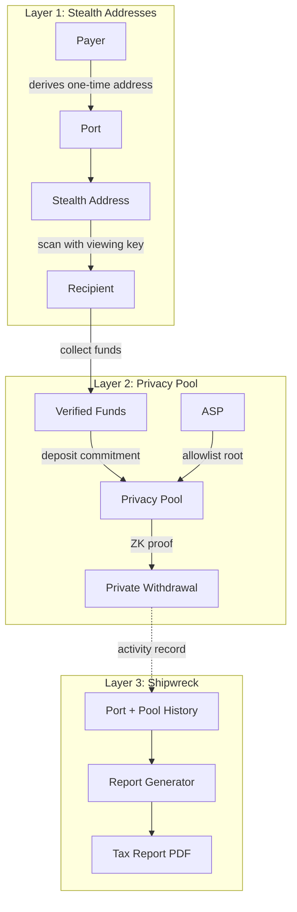
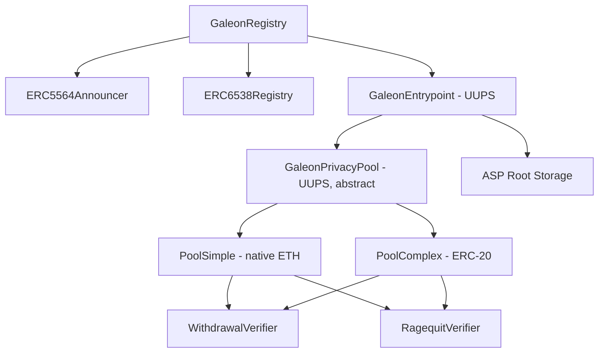

# Galeon: Private Payments, Verifiable Compliance

**A three-layer privacy stack for on-chain finance**

Version 0.1 | February 2026

Authors: Mateo Daza, Carlos Quintero

---

## Table of Contents

**Part I: The Protocol**

1. [The Privacy Problem in On-Chain Finance](#1-the-privacy-problem-in-on-chain-finance)
2. [Three-Layer Architecture](#2-three-layer-architecture)
3. [How It Works](#3-how-it-works)
4. [Trust Model and Current Limitations](#4-trust-model-and-current-limitations)
5. [Competitive Landscape](#5-competitive-landscape)
6. [Status and Roadmap](#6-status-and-roadmap)

**Part II: Technical Specification** 7. [Cryptographic Primitives](#7-cryptographic-primitives) 8. [Smart Contract Architecture](#8-smart-contract-architecture) 9. [Privacy Pool Protocol](#9-privacy-pool-protocol) 10. [Announcement Scanning and View Tags](#10-announcement-scanning-and-view-tags) 11. [Relayer Architecture](#11-relayer-architecture) 12. [Shipwreck Compliance Layer](#12-shipwreck-compliance-layer) 13. [Security Considerations](#13-security-considerations) 14. [Chain Compatibility](#14-chain-compatibility) 15. [References](#15-references)

---

# Part I: The Protocol

## 1. The Privacy Problem in On-Chain Finance

Every on-chain transaction is public. Payroll, vendor payments, and treasury moves are all visible to competitors, employees, and anyone with a block explorer. This transparency is a feature for auditability, but it makes it impossible for businesses and individuals to operate with basic financial privacy.

A freelancer who shares a payment address with a client exposes their entire income history. A business paying a supplier reveals its pricing to competitors. A DAO treasury's movements can be front-run by traders watching the mempool. These are not hypothetical scenarios. They are the default experience of using public blockchains for finance today.

Existing privacy tools solved this by making everything anonymous, which made them unusable for legitimate use and got them sanctioned. Tornado Cash proved that demand for on-chain privacy is real (over $700M in deposits at peak), but offered no mechanism for compliance. There was no way to distinguish legitimate users from illicit ones, and the protocol was sanctioned by OFAC in August 2022. Privacy without accountability is a dead end.

Privacy Pools, based on the 2023 paper co-authored by Vitalik Buterin and Chainalysis's Jacob Illum, proved you can have both: users deposit into a pool and prove their funds come from a compliant set (an Association Set Provider tree) without revealing which specific deposit is theirs, giving the user privacy while keeping the system auditable. Since then, the design space has split between blocklist models (prove you are not on a sanctions list) and allowlist models (prove membership in a set of approved participants). Each makes different trade-offs between openness and compliance strictness.

What has been missing is a system that combines receiver privacy (so payers cannot trace recipients), sender privacy (so withdrawals cannot be linked to deposits), and compliance tooling (so users can prove the legitimacy of their funds when needed). Galeon is that system.

## 2. Three-Layer Architecture

Galeon is privacy infrastructure for on-chain finance. The protocol combines stealth addresses (EIP-5564/6538) with Privacy Pools and a compliance layer into three distinct layers, each addressing a different privacy gap. The layers work together, but each provides value independently.



### Layer 1: Stealth Addresses (Receiver Privacy)

The first problem is address reuse. When Alice gives Bob her Ethereum address, Bob can see every other transaction Alice has ever made with that address. Every future payment Alice receives there is also visible to Bob. This makes it impossible to maintain financial privacy across multiple relationships.

Galeon solves this with stealth addresses, following EIP-5564 for the announcement scheme and referencing EIP-6538 for the meta-address format. Instead of publishing a regular Ethereum address, Alice publishes a stealth meta-address. When Bob wants to pay Alice, his wallet uses Alice's meta-address to derive a fresh, one-time address that only Alice can detect and control. From the perspective of any outside observer, the payment goes to an address with no visible connection to Alice.

Galeon organizes stealth addresses into Ports. A Port is a named payment endpoint with its own cryptographically independent key pair. Alice might create a Port called "Freelance" for client payments and another called "Donations" for open-source contributions. If the viewing key for one Port is compromised, no other Port is affected. Port types (permanent, recurring, one-time, burner) map to real-world payment patterns.

The key innovation here is per-Port key isolation. Each Port derives its spending and viewing keys independently using HKDF with the Port index as a unique salt. Compromise of one Port's viewing key reveals nothing about any other Port. This is a meaningful improvement over single-keypair stealth address schemes where one leak exposes everything.

### Layer 2: Privacy Pool (Sender Privacy + Compliance)

Stealth addresses protect the recipient, but the sender's address is still visible on-chain. Anyone can see where the funds came from. For many use cases, this is just as problematic as recipient exposure.

Galeon addresses sender privacy through a Privacy Pool based on the model proposed in the Privacy Pools paper. Users deposit funds into the pool by creating a cryptographic commitment. When they want to withdraw, they generate a zero-knowledge proof demonstrating ownership of a valid deposit and membership in an approved set, without revealing which specific deposit is theirs.

The compliance mechanism is an Association Set Provider (ASP). The ASP maintains a Merkle tree of approved deposit labels. To withdraw from the pool, a user must prove that their deposit's label is included in the ASP's current tree. This is the allowlist model: rather than proving you are not on a bad list, you prove you are on an approved list.

This design has an important constraint: only funds received through Galeon Ports can enter the pool. The system tracks a verified balance for each stealth address, recording how much was received through legitimate Port payments. This prevents users from depositing funds sent directly to stealth addresses from unknown sources, ensuring the entire anonymity set consists of verified participants.

#### The ASP Philosophy: Allowlists, Not Blocklists

The distinction between allowlist and blocklist models is not just an implementation detail. It reflects a fundamentally different philosophy about how privacy and compliance should coexist.

In a blocklist model (used by Railgun's Private Proofs of Innocence), the default state is "everyone is approved." Users prove their funds do not appear on a list of known bad actors. This is reactive: the system only catches threats it already knows about. A new exploit, a freshly sanctioned address, or a sophisticated laundering scheme can enter the pool before the blocklist is updated. The compliance guarantee is backward-looking.

In an allowlist model (the Privacy Pools approach), the default state is "nobody is approved until verified." The ASP actively decides which deposits are eligible for private withdrawal. This is proactive: new deposits sit in the pool but cannot be privately withdrawn until the ASP includes them. A bad actor who deposits funds cannot extract them privately because their label will never appear in the approved set.

This creates a stronger compliance posture. Regulators and institutions can reason about the allowlist model more easily because the question changes from "can you prove this user is not bad?" to "can you prove this user was explicitly vetted?" The burden of proof shifts in a way that mirrors how traditional financial compliance works: you verify your customers, not retroactively check them against evolving lists.

The trade-off is latency. In a blocklist model, withdrawals are instant because the default is approval. In an allowlist model, there is a window between deposit and ASP approval where funds cannot be privately withdrawn. Galeon's ASP currently auto-approves every 15 seconds, keeping this window minimal for legitimate users.

The ASP also creates an important safety valve. If the ASP discovers that a previously approved deposit was made with illicit funds, it can exclude that label from future root updates. The deposit remains in the pool, but the depositor can no longer withdraw privately. They can still ragequit (reclaiming funds publicly), but the anonymity set is preserved for everyone else. This is a surgical response compared to the blocklist model, where the entire pool's reputation is affected by the presence of flagged funds.

For Galeon, the ASP is the bridge between privacy and institutional trust. It allows the protocol to offer genuine privacy (zero-knowledge proofs, unlinkable deposits and withdrawals) while maintaining a verifiable compliance layer that regulators can audit. The contract interface supports publishing IPFS CIDs alongside each root update, creating the foundation for a transparent audit trail of compliance decisions. Full IPFS-backed auditability is a target-state feature as the ASP matures.

This is where the connection to Shipwreck becomes clear. The ASP provides system-level compliance (the pool only contains approved funds). Shipwreck provides user-level compliance (individuals can prove the source and history of their specific funds for tax purposes). Together, they form a two-sided compliance model: the protocol is auditable from the outside, and users are accountable from the inside.

### Layer 3: Shipwreck (Tax Compliance)

Privacy is useful only if users can still meet their legal obligations. A system where funds become untraceable, even to the user, creates problems at tax time.

Shipwreck is Galeon's compliance reporting layer. It generates tax reports from on-chain data combined with the user's Port records. Reports include income summaries by Port, transaction details (including payer addresses and amounts), totals per reporting period, and jurisdiction-specific formatting for US and Colombian tax requirements.

Reports are generated server-side and exported as PDFs. The user decides when to request a report, what period to cover, and with whom to share the exported file.

The name "Shipwreck" reflects a deliberate design philosophy: full privacy sometimes needs to be broken, but only on the user's terms.

## 3. How It Works

### Receiving a Private Payment

Alice creates a Port called "Freelance Income" in the Galeon app. She receives a payment link that she shares with her client, Bob.

Bob opens the link and connects his wallet. The Galeon interface uses Alice's stealth meta-address to derive a one-time stealth address and prompts Bob to send 100 USDC. Bob confirms the transaction in his wallet.

The payment lands at a stealth address that has no visible connection to Alice on-chain. The contract emits an announcement event containing the ephemeral public key, a view tag, and the Port identifier.

Alice opens Galeon and her client scans recent announcement events using her viewing key. The view tag allows her to discard 99.6% of non-matching announcements early, skipping the full address derivation step. When a match is found, the client derives the stealth private key and displays the incoming payment. Alice collects the funds to her wallet with a single transaction.

### Making a Private Withdrawal

Alice has collected funds from several Port payments. She wants to pay Carol without revealing the source of her funds.

Alice deposits her collected funds into the Privacy Pool. The Galeon frontend generates a cryptographic commitment (a Poseidon hash of the deposit value, a unique label, and a precommitment derived from her master keys). The contract verifies that Alice's stealth address has sufficient verified balance and inserts the commitment into a Merkle tree.

The ASP reviews the deposit and includes its label in the approved set. When Alice is ready to withdraw, the frontend generates a Groth16 zero-knowledge proof. This proof demonstrates that Alice knows a valid commitment in the state tree whose label is included in the ASP's approved set, without revealing which commitment is hers.

Alice submits the proof to a relayer, which broadcasts the withdrawal transaction on her behalf. Carol receives the funds from the pool contract with no on-chain link to Alice's original deposit.

### Filing Taxes

At the end of the tax year, Alice opens Shipwreck in the Galeon dashboard. She selects her jurisdiction and reporting period. The system compiles income data from her Port history: amounts received, dates, and Port labels. Alice exports a PDF summarizing her activity and provides it to her accountant.

## 4. Trust Model and Current Limitations

Galeon is transparent about its current trust assumptions. These are engineering decisions made for an early-stage protocol, each with a clear path toward improvement.

**Viewing key custody.** Port viewing keys are currently stored server-side, encrypted with an application key. This means the Galeon server can scan announcement events and determine which payments arrived at which Ports. Users get privacy from the public blockchain, but not from the Galeon operator. The path forward is client-side viewing key management, where keys never leave the user's device.

**Centralized relayer.** The relayer that submits pool withdrawals on behalf of users is operated by Galeon. If the relayer goes offline, users can still withdraw directly (losing sender privacy) or execute a ragequit (an emergency exit that returns deposited funds to the original depositor). The relayer cannot steal funds because proofs are generated client-side. The path forward is a decentralized relayer network with fee-based incentives.

**Single ASP operator.** The Association Set Provider that maintains the allowlist of approved deposits is currently a single entity operated by Galeon. This creates a centralized compliance decision point. The path forward is multiple independent ASPs, with users choosing which ASP to trust, and eventually DAO governance over ASP inclusion policies.

**Public Port labels.** Port names (such as "Freelance" or "Donations") are stored on-chain and visible to anyone. Users should be aware of this when naming Ports. The path forward is storing only hashes on-chain with encrypted labels managed client-side.

**No external users.** The protocol is working on EVM mainnet, but all activity to date is from the development team. The anonymity set is currently empty in practice. Privacy guarantees strengthen as more users deposit into the pool.

These limitations are intentional trade-offs, not oversights. Galeon follows a model of progressive decentralization: start from a position where compliance is possible and the system works, then systematically reduce trust assumptions as the protocol matures.

## 5. Competitive Landscape

| Feature          | Tornado Cash | Railgun             | 0xbow              | Aztec             | Galeon                        |
| ---------------- | ------------ | ------------------- | ------------------ | ----------------- | ----------------------------- |
| Compliance model | None         | Blocklist (PPOI)    | Allowlist (ASP)    | None (L2 privacy) | Allowlist (ASP)               |
| Receiver privacy | No           | Shielded pool       | No                 | Yes (L2)          | EIP-5564 stealth addresses    |
| Sender privacy   | Yes (mixer)  | Yes (shielded pool) | Yes (Privacy Pool) | Yes (private L2)  | Yes (Privacy Pool)            |
| Tax reporting    | No           | Koinly export       | No                 | No                | Shipwreck                     |
| Standards used   | Custom       | Proprietary (0zk)   | Privacy Pools      | Custom ZK-rollup  | EIP-5564/6538 + Privacy Pools |
| EVM native       | Yes          | Yes                 | Yes                | No (separate L2)  | Yes                           |

**Tornado Cash** validated the market need for on-chain privacy. Its $700M+ TVL proved demand exists. But the absence of any compliance mechanism made it a target for sanctions and demonstrated that pure anonymity is not viable for legitimate financial use.

**Railgun** uses a blocklist model called Private Proofs of Innocence (PPOI), where users prove their funds do not originate from sanctioned addresses. Railgun also provides receiver privacy through a proprietary shielded pool and supports tax exports through Koinly integration. The architectural difference with Galeon is the compliance model (blocklist vs. allowlist) and the address standard (proprietary 0zk addresses vs. EIP-5564 stealth addresses that are composable with any EIP-5564-compatible wallet).

**0xbow** is building the Privacy Pools primitive: the mixing mechanism with ASP-gated withdrawals. Galeon builds on the same Privacy Pools model and adds stealth addresses for receiver privacy, a relayer for sender privacy, and Shipwreck for compliance reporting. The relationship is complementary: 0xbow provides the core mechanism, while Galeon provides the end-to-end product layer.

**Aztec** takes a fundamentally different approach by building a separate L2 with native privacy. This offers the most complete privacy guarantees but requires users to bridge assets to a new execution environment. Galeon is EVM-native and deployable as standard Solidity on any compatible chain, requiring no ecosystem migration.

No other protocol currently combines EIP-5564 stealth addresses, the Privacy Pools allowlist model, and integrated tax compliance reporting in a single implementation.

## 6. Status and Roadmap

### Shipped

- Stealth address system with per-Port key isolation (EIP-5564/6538)
- Privacy Pool v1 with Groth16/Poseidon/BN254
- Relayer for private pool withdrawals
- ASP auto-approve service
- Shipwreck tax reports with PDF export (US/CO jurisdictions)
- Full user flow: setup, create Port, share payment link, pay, detect, collect
- Ragequit mechanism (contract-level emergency exit)
- Working protocol on EVM mainnet

### In Development

- Account model with merge-on-deposit (constant-time withdrawals regardless of deposit history)
- Decentralized relayer network
- Client-side viewing key management
- Multi-chain deployment
- Independent security audit (ZK circuits + smart contracts)
- Multiple independent ASP operators

---

The sections above describe what Galeon does and why. The remainder of this document describes how it works at the cryptographic and systems level. Readers interested in implementation details, circuit design, and protocol security analysis will find the technical specification below.

---

# Part II: Technical Specification

## 7. Cryptographic Primitives

### 7.1 Key Derivation

Galeon derives all cryptographic keys deterministically from a single wallet signature using HKDF-SHA256 (RFC 5869) with domain-separated contexts. The user signs a fixed message:

```
Galeon Stealth Key Derivation

Sign this message to derive your stealth keys.
This does NOT authorize any transactions.
```

The signature bytes serve as the input key material (IKM) for HKDF. A fixed non-zero salt (the SHA-256 hash of `galeon-hkdf-salt-v1`) is used for all derivations. Domain separation is achieved through distinct info strings:

| Purpose            | Domain String                                   |
| ------------------ | ----------------------------------------------- |
| Spending key       | `galeon-stealth-spending-v1`                    |
| Viewing key        | `galeon-stealth-viewing-v1`                     |
| Port-specific keys | `galeon-port-derivation-v1-{spending\|viewing}` |
| Pool nullifier key | `galeon-pool-nullifier-v1`                      |
| Pool secret key    | `galeon-pool-secret-v1`                         |

Each derivation produces 32 bytes, which are reduced modulo the secp256k1 curve order to obtain a valid private key. The modular reduction bias is negligible at approximately 2^-128.

For per-Port key isolation, the Port index (a non-negative integer) is encoded as a 32-byte big-endian value and used as the HKDF salt, replacing the default salt. This ensures that each Port's spending and viewing keys are cryptographically independent. Compromising Port 0's viewing key reveals nothing about Port 1's keys because the HKDF salt differs.

### 7.2 Stealth Address Generation (EIP-5564)

A stealth meta-address encodes two compressed secp256k1 public keys in the format:

```
st:<chain_prefix>:0x<spending_public_key:33 bytes><viewing_public_key:33 bytes>
```

When a payer wants to send funds to a stealth meta-address:

1. **Generate ephemeral keypair**: The payer generates a random ephemeral private key `r` and computes the ephemeral public key `R = r * G`.

2. **Compute shared secret**: The payer performs ECDH with the recipient's viewing public key: `S = ECDH(r, V)`. The shared secret is the keccak256 hash of the x-coordinate of the resulting point: `s = keccak256(S.x)`.

3. **Derive stealth public key**: `P_stealth = P_spending + s_scalar * G`, where `s_scalar = s mod n`.

4. **Derive stealth address**: The Ethereum address is the last 20 bytes of `keccak256(P_stealth_uncompressed)`.

5. **Compute view tag**: The first byte of `s` serves as the view tag for efficient scanning.

The recipient recovers the stealth private key as: `k_stealth = k_spending + s_scalar mod n`, where `s_scalar` is derived from `ECDH(k_viewing, R)`.

### 7.3 Poseidon Hash

The Privacy Pool uses the Poseidon hash function for all circuit-internal hashing. Poseidon is designed for arithmetic circuits and requires approximately 10x fewer constraints than keccak256 in a Groth16 circuit.

Galeon uses Poseidon over the BN254 scalar field:

```
SNARK_SCALAR_FIELD = 21888242871839275222246405745257275088548364400416034343698204186575808495617
```

Key constructions:

- **Precommitment**: `PoseidonT3(nullifier, secret)`
- **Deposit commitment**: `PoseidonT4(value, label, precommitment)`
- **Per-deposit nullifier**: `PoseidonT4(masterNullifier, scope, depositIndex)`
- **Per-deposit secret**: `PoseidonT4(masterSecret, scope, depositIndex)`
- **Label**: `keccak256(scope, nonce) mod SNARK_SCALAR_FIELD`

### 7.4 BN254 Curve and EVM Precompiles

Groth16 proof verification on-chain requires three BN254 (alt-bn128) precompiled contracts:

| Precompile | Address | Operation                   |
| ---------- | ------- | --------------------------- |
| ecAdd      | `0x06`  | Point addition on G1        |
| ecMul      | `0x07`  | Scalar multiplication on G1 |
| ecPairing  | `0x08`  | Bilinear pairing check      |

The verification equation is:

```
e(pi_A, pi_B) = e(alpha, beta) * e(vk_x, gamma) * e(pi_C, delta)
```

These precompiles are available on Ethereum mainnet and most EVM-compatible L2s, making the protocol portable across chains without modification.

## 8. Smart Contract Architecture

Galeon's on-chain components are organized into five core contracts:



### 8.1 GaleonRegistry

The registry manages Ports, processes payments, and tracks verified balances. Key responsibilities:

- **Port registration**: Links a `portId` to a stealth meta-address on-chain. Stores Port metadata (name, type, status).
- **Payment processing**: Accepts native currency or ERC-20 tokens, transfers them to the derived stealth address, and emits an announcement through the ERC5564Announcer in a single transaction.
- **Verified balance tracking**: Records how much each stealth address received through legitimate Port payments. This balance is consumed when funds are deposited into the Privacy Pool, preventing double-deposit attacks.
- **Stealth address freezing**: Allows deactivation of stealth addresses associated with closed Ports. Frozen addresses cannot deposit into the pool.
- **Receipt anchoring**: Anchors keccak256 hashes of payment receipts on-chain via `ReceiptAnchored` events, creating a verifiable record of payment metadata.

### 8.2 GaleonPrivacyPool

The Privacy Pool contract is forked from 0xbow's `privacy-pools-core` (Apache-2.0) with the following modifications:

1. **Port-only deposit restriction**: `galeonRegistry.canDeposit()` is called at deposit time to verify the depositor is a Port stealth address with sufficient verified balance.
2. **Verified balance consumption**: Depositing deducts from the stealth address's verified balance, preventing double-deposits.
3. **Deposit-time blocklist**: Frozen stealth addresses (from deactivated Ports) are rejected at deposit time.
4. **UUPS upgradeability**: All pool instances and the entrypoint are upgradeable proxies.
5. **Swappable verifiers**: Circuit verifiers can be replaced without redeploying the pool, allowing circuit upgrades.
6. **Per-proxy SCOPE**: Each pool instance receives a unique SCOPE value for proof domain separation.

The state tree is a 32-depth Lean Incremental Merkle Tree (LeanIMT) using Poseidon hashes. The contract caches the 64 most recent roots, giving users flexibility in proof timing.

### 8.3 GaleonEntrypoint

The entrypoint coordinates deposits across pools and manages ASP roots. It is the central authority for:

- **Pool registry**: Maps SCOPE values to pool contract addresses.
- **ASP root management**: The `ASP_POSTMAN` role calls `updateRoot()` to publish new Merkle roots of approved deposit labels. The contract accepts an IPFS CID field for linking to approval data (currently a placeholder; full IPFS publication is planned).
- **Deposit routing**: Validates precommitment uniqueness and routes deposits to the correct pool.
- **Withdrawal processing**: Verifies Groth16 proofs and executes fund transfers.
- **Nullifier tracking**: Prevents double-spending by recording used nullifier hashes.

### 8.4 Upgradeability

All core contracts use the UUPS (Universal Upgradeable Proxy Standard) pattern. This is an intentional design choice for an early-stage protocol where compliance requirements may change, circuits may need updates, and bugs may need fixing. The upgrade authority is currently a single admin address, with plans to transition to a multisig and eventually DAO governance.

## 9. Privacy Pool Protocol

### 9.1 Deposit Flow

1. The user collects funds from Port stealth addresses.
2. The frontend derives deposit parameters deterministically from the user's master keys:
   - `nullifier = Poseidon(masterNullifier, scope, depositIndex)`
   - `secret = Poseidon(masterSecret, scope, depositIndex)`
   - `precommitment = Poseidon(nullifier, secret)`
3. The user calls `deposit(precommitment)` on the entrypoint, sending the deposit value.
4. The contract verifies:
   - The depositor address is a registered Port stealth address.
   - The verified balance is sufficient for the deposit amount.
   - The depositor is not on the blocklist (not frozen).
   - The precommitment has not been used before.
5. A label is computed: `keccak256(SCOPE, nonce) mod SNARK_SCALAR_FIELD`.
6. The commitment `Poseidon(value, label, precommitment)` is inserted into the state tree.
7. The label-to-depositor mapping is stored for ragequit purposes.
8. The verified balance is consumed (decremented by the deposit amount).

Because nullifiers and secrets are derived deterministically from `(masterKeys, scope, depositIndex)`, users can recover all their deposits by scanning on-chain events. No server-side storage is required.

### 9.2 Withdrawal Flow

1. The user decides to withdraw amount X from the pool.
2. The frontend reconstructs the state tree from on-chain events (all commitment insertions).
3. The frontend fetches the latest ASP Merkle root and corresponding tree data from the backend API.
4. The frontend generates a Groth16 proof with the following structure:

**Private inputs:**

- `label` (from the original deposit)
- `existingValue`, `nullifier`, `secret` (the user's deposit details)
- `newNullifier`, `newSecret` (for the remaining balance commitment)
- `stateSiblings[]` (Merkle path in the state tree)
- `ASPSiblings[]` (Merkle path in the ASP tree)

**Public inputs:**

- `withdrawnValue` (amount to withdraw)
- `stateRoot` (current state tree root)
- `stateTreeDepth` (depth of state tree)
- `ASPRoot` (latest ASP root)
- `ASPTreeDepth` (depth of ASP tree)
- `context` (domain binding: `keccak256(withdrawalData, SCOPE) mod SNARK_SCALAR_FIELD`)

The proof demonstrates:

- The user knows a commitment that exists in the state tree.
- The commitment's label is in the ASP's approved set.
- The remaining balance is non-negative and fits in 128 bits.
- The nullifier hash has not been used before.

5. The proof is sent to the relayer, which submits the transaction on the user's behalf.
6. The contract verifies the proof via BN254 precompiles, marks the nullifier as spent, inserts a new commitment for the remaining balance, and transfers the withdrawn amount to the specified recipient.

### 9.3 ASP (Association Set Provider)

The ASP is the on-chain enforcement mechanism for the allowlist compliance model. Its design is central to how Galeon achieves privacy with verifiable compliance.

#### Operational Flow

1. An off-chain service monitors `Deposited` events on the pool contract.
2. For each new deposit, the ASP evaluates whether the deposit label should be approved (currently auto-approved every 15 seconds).
3. The ASP maintains a Merkle tree of approved labels.
4. The ASP calls `updateRoot(root, ipfsCID)` to publish the new root on-chain. The contract accepts an IPFS CID for linking to full tree data; in the current implementation, this field uses a placeholder value. Full IPFS-backed data publication is planned.
5. Only the latest ASP root is accepted for withdrawal proofs.

#### Security Properties

The ASP's power is deliberately constrained:

- **Cannot steal funds.** The ASP never has custody of deposited assets. Funds are held by the pool contract and released only upon valid proof verification.
- **Cannot forge proofs.** Withdrawal proofs are generated client-side using the user's private inputs. The ASP has no access to nullifiers, secrets, or private keys.
- **Cannot prevent ragequits.** Even if the ASP excludes a label, the original depositor can always execute a ragequit to recover their funds. The ragequit circuit does not reference the ASP root.
- **Limited deanonymization surface.** Deposit events on-chain do emit the depositor address and value. The ASP's Merkle tree itself contains only labels (hashes derived from the pool's SCOPE and a nonce), but an ASP operator monitoring on-chain events can observe which addresses deposited which amounts. The privacy guarantee is that withdrawals cannot be linked back to specific deposits, not that deposits themselves are hidden.

#### Transparency and Auditability

Every ASP root update is an on-chain transaction. The contract interface includes an IPFS CID field for linking to full approval tree data, enabling a future state where a regulator, auditor, or researcher can:

1. Query the `updateRoot()` event history to see every root ever published.
2. Fetch the corresponding IPFS data to reconstruct the full approval tree at any point in time.
3. Verify that any specific label was included or excluded from any historical root.
4. Independently recompute the Merkle root from the published data to confirm integrity.

In the current implementation, the IPFS CID field uses a placeholder. Full data publication is a near-term milestone. The design goal is that ASP compliance decisions become verifiable public records, making the ASP accountable in a way that traditional compliance systems (where approval/denial decisions are opaque) are not.

#### Path to Decentralization

The current single-operator ASP is a starting point, not the end state. The protocol is designed to support multiple independent ASPs:

- Each ASP publishes its own root to the entrypoint contract.
- Users choose which ASP's root to reference in their withdrawal proof.
- Different ASPs can apply different compliance policies (jurisdictional requirements, risk tolerance, verification standards).
- Competition between ASPs creates incentives for fair, transparent operation.

This mirrors how certificate authorities work in TLS: multiple independent entities provide attestation, and users (or their software) choose which to trust.

### 9.4 Ragequit (Emergency Exit)

If a deposit is excluded from the ASP's approved set (or if the ASP goes offline), the original depositor can execute a ragequit. This is a separate circuit that proves knowledge of the deposit details and requires the caller to be the address stored in the `depositors[label]` mapping. The depositor receives their full deposit back, but their identity is revealed on-chain (since the withdrawal is linked to their deposit). Ragequit preserves the privacy of all other pool participants.

## 10. Announcement Scanning and View Tags

Recipients detect incoming stealth payments by scanning `Announcement` events emitted by the ERC5564Announcer contract. Each event contains the ephemeral public key, the stealth address, and encoded metadata.

For each announcement, the recipient:

1. Extracts the view tag from the metadata (first byte).
2. Computes the expected view tag: `computeViewTag(ephemeralPubKey, viewingPrivateKey)`.
3. If the tags do not match, skips the announcement (99.6% of the time).
4. If the tags match, performs the full ECDH computation to derive the stealth address.
5. Compares the derived address to the announced address. If they match, the payment belongs to this recipient.
6. Extracts metadata: receipt hash, Port ID, token address, and amount.

In the current implementation, computing the view tag requires an ECDH operation per announcement. The benefit of view tags is that non-matching announcements (99.6%) are discarded after a single ECDH, without performing the additional steps of stealth address derivation, address comparison, and metadata extraction. In a future optimization, view tags could be computed via a lighter cryptographic operation, reducing the per-announcement cost further. View tags remain critical for scalability as the number of on-chain announcements grows.

**Metadata encoding in announcements:**

| Bytes  | Content                     |
| ------ | --------------------------- |
| 0      | View tag                    |
| 1-32   | Receipt hash                |
| 33-64  | Port ID                     |
| 65-84  | Token address (ERC-20 only) |
| 85-116 | Amount (ERC-20 only)        |

## 11. Relayer Architecture

The relayer exists to protect sender privacy during pool withdrawals. Without a relayer, the user would submit the withdrawal transaction from their own address, creating an on-chain link between their identity and the withdrawal.

**Current design**: A centralized relayer operated by Galeon receives signed withdrawal proofs from users and submits them to the pool contract. The relayer deducts a configurable fee from the withdrawal amount.

**Trust properties**: The relayer cannot steal funds because the proof specifies the recipient address. The relayer cannot modify the withdrawal amount because it is a public input to the verified proof. The relayer can only submit or refuse to submit the transaction.

**Liveness guarantees**: If the relayer goes offline, users have two fallback options:

- Submit the withdrawal transaction directly (losing sender privacy but retaining funds).
- Execute a ragequit to recover the original deposit.

## 12. Shipwreck Compliance Layer

Shipwreck generates tax compliance reports from on-chain data combined with the user's Port records.

**Data sources:**

- Port payment history (amounts, dates, Port labels)
- Privacy Pool deposit and withdrawal records
- On-chain receipt anchors (`ReceiptAnchored` events)
- Timestamps from block data

**Jurisdiction support:**

- United States: tracks unique payer counts above the $600 1099 reporting threshold
- Colombia: standard income reporting format

**Output:** Server-generated PDF export with per-Port income breakdown, transaction details (including payer addresses), period totals, and payer statistics.

Shipwreck is not a regulatory filing tool and does not claim to satisfy any specific regulatory requirement. It organizes the user's on-chain financial data into a format that is useful for accountants, auditors, and tax authorities. Users control when reports are requested and with whom they share the exported files.

## 13. Security Considerations

### 13.1 Threat Model

Galeon provides privacy from public blockchain observers. In its current architecture, it does not provide privacy from the Galeon operator (due to server-side viewing key custody). The system is designed so that:

- An observer with access only to on-chain data cannot link stealth addresses to recipients.
- An observer cannot link pool deposits to withdrawals.
- The ASP operator cannot steal funds or forge proofs.
- A compromised Port viewing key exposes only that Port's payments (per-Port key isolation limits the blast radius).

### 13.2 Known Attack Surfaces

**Timing analysis.** A deposit immediately followed by an equal-value withdrawal may be correlated by an observer. This risk decreases as the anonymity set grows and as time passes between deposits and withdrawals.

**Amount correlation.** If the pool has limited deposit diversity, specific amounts may be linkable across deposits and withdrawals. This risk also decreases with pool usage.

**Server compromise.** Viewing keys are encrypted with an application key. If the application key is compromised, an attacker could scan announcements and determine which payments arrived at which Ports. This does not allow fund theft (spending keys are derived client-side per transaction) but does break payment privacy.

**Front-running.** Deposit transactions are public and could theoretically be front-run. The practical impact is minimal because deposits are permissioned through the verified balance system.

### 13.3 Circuit Security

The Privacy Pool circuits are forked from 0xbow's audited implementation. Galeon-specific modifications (Port-only deposit gating, verified balance consumption, UUPS upgradeability) have not yet undergone independent audit.

The Groth16 proving system requires a trusted setup ceremony. Galeon uses the ceremony parameters from the upstream 0xbow implementation.

The circuits impose a 128-bit value limit (maximum deposit or withdrawal of 2^128 wei), which is practically unlimited for real-world use.

### 13.4 Contract Security

- The registry and entrypoint contracts use `ReentrancyGuard` on value transfers. Pool contracts rely on nullifier-based state transitions rather than reentrancy guards for withdrawal safety.
- ERC-20 operations use `SafeERC20` from OpenZeppelin.
- UUPS upgradeability means the admin can modify contract logic. Users trust the admin not to introduce malicious upgrades. This is a known centralization vector with a clear upgrade path to multisig and DAO governance.
- The state tree caches 64 historical roots, bounding state growth while providing withdrawal timing flexibility.

## 14. Chain Compatibility

Galeon is deployable on any EVM-compatible blockchain that supports the BN254 precompiled contracts at addresses `0x06`, `0x07`, and `0x08`. These precompiles are part of the Ethereum Yellow Paper and are available on:

- Ethereum mainnet
- Arbitrum, Optimism, Base, and other OP Stack / Arbitrum Nitro L2s
- Polygon PoS and zkEVM
- Mantle
- BNB Chain
- Most EVM-compatible L1s and L2s

The contract architecture contains no chain-specific logic. Stealth meta-addresses support extensible chain prefixes. Native currency is handled through the ERC-7528 sentinel address pattern, and ERC-20 tokens are supported via SafeERC20.

Deploying Galeon on a new chain is a redeployment of standard Solidity contracts, not a rewrite.

## 15. References

1. Buterin, V., Illum, J., Nadler, M., Schoar, A., and Soleimani, A. "Blockchain Privacy and Regulatory Compliance: Towards a Practical Equilibrium." 2023. https://papers.ssrn.com/sol3/papers.cfm?abstract_id=4563364

2. EIP-5564: Stealth Addresses. ScopeLift, 2023. https://eips.ethereum.org/EIPS/eip-5564

3. EIP-6538: Stealth Meta-Address Registry. ScopeLift, 2023. https://eips.ethereum.org/EIPS/eip-6538

4. Grassi, L., Khovratovich, D., Rechberger, C., Roy, A., and Schofnegger, M. "Poseidon: A New Hash Function for Zero-Knowledge Proof Systems." USENIX Security, 2021.

5. Groth, J. "On the Size of Pairing-Based Non-Interactive Arguments." EUROCRYPT, 2016.

6. Privacy & Scaling Explorations (PSE). "Lean Incremental Merkle Tree (LeanIMT)." zk-kit. https://github.com/privacy-scaling-explorations/zk-kit

7. ERC-7528: ETH (Native Asset) Address Convention. https://eips.ethereum.org/EIPS/eip-7528

---

_Galeon is open source._

_Privacy is a right. Compliance is a responsibility._
